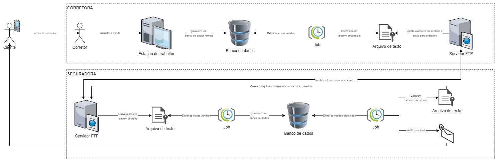

<h1 align="center">
    CHALLENGE - SR. SOFTWARE ENGINEER
</h1>

## Índice
1. [**Introdução**](#1-introdução)
2. [**Solução As Is**](#2-solução-as-is)
3. [**Premissas**](#3-premissas)
4. [**O que é esperado**](#4-o-que-é-esperado)
5. [**O que será avaliado**](#5-o-que-será-avaliado)
6. [**Dúvidas**](#6-dúvidas)

---

## 1. Introdução
Você foi contratado por uma seguradora para apoiar na modernização e inovação de todo ecossistema de uma jornada de contratação de seguros para automóveis no território nacional.
É de conhecimento que o índice de criminalidade varia de região para região nesse "continente" chamado Brasil. :-D

Atualmente, toda a jornada de contratação é realizada através troca de arquivos e processamentos batch, entre corretoras parceiras e a respectiva seguradora.
Com o objetivo de alavancar vendas e oferecer uma jornada mais digital para os parceiros (corretoras) e os clientes, há o grande anseio em tornar essa jornada mais fluída e gerenciável.

## 2. Solução As Is
Visualize o desenho de solução As Is para entender melhor o fluxo.

## 3. Premissas
- não será permitida troca de arquivos;
- só serão permitidas comunicações remotas através de protolocos seguros e criptogrados;
- a solução deve possuir resiliência, alta disponibilidade e tolerância à falhas;
- deverá existir uma convivência entre o modernizado e o legado (o legado da Seguradora não pode ser modernizado devido ao seu tamanho - e tempo é dinheiro)
- todo o ecossitema da corretora deverá ser modernizado (cotação e contratação, por exemplo)
- parte do ecossistema de seguradora deverá ser modernizado, para que a comunicação com a corretora ocorra de maneira eficaz (invocações de chamadas HTTP, por exemplo)

## 4. O que é esperado
Você deve modelar e implementar uma solução em núvem pública seguindo princípios de uma arquitetura moderna:
- 12 factors
- arquitetura distribuída
- comunicação assíncrona
- serverless
- orientada e segregada por domínio
- finops
- monitoramento e observabilidade
- qualidade de código
- estilos arquiteturais

## 5. O que será avaliado
- qualidade de legibilidade de código
- cobertura de testes
- aplicabilidade de padrões de projetos
- arquitetura dos apps
- desenho de arquitetura da solução modernizada

## 6. Dúvidas
Em caso de dúvidas, contacto-nos o quanto antes através dos e-mails informados nas etapas anteriores do processo seletivo.

Lembrando que não existe "bala de prata" e solução perfeita!

VEM COM A GENTE! 🍊🚀
# challenge-software-engineer
