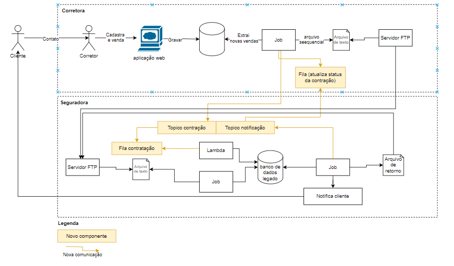
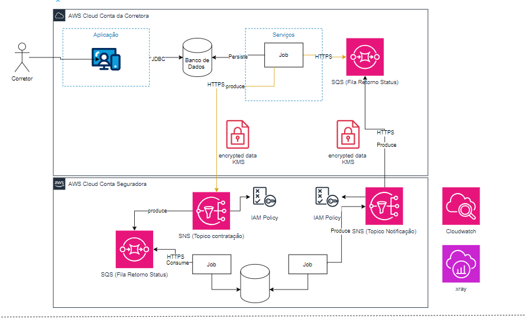
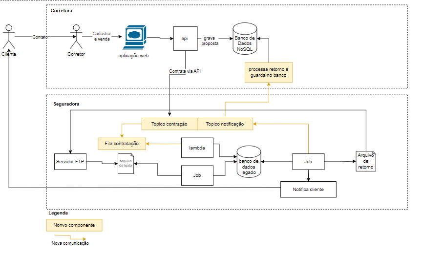
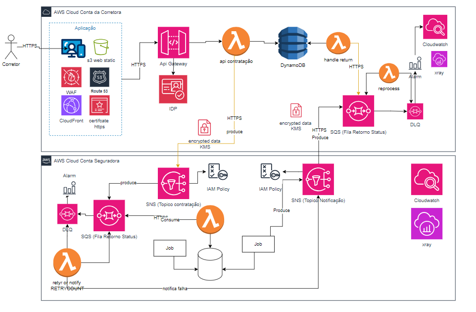
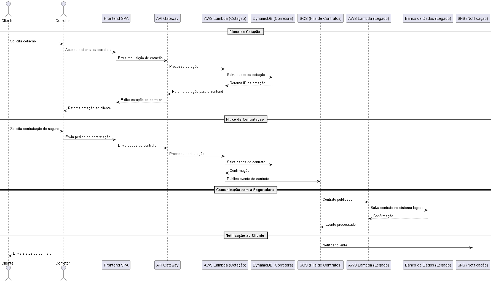

# Descrição da Solução: Challenge Sr. Software Engineer

Este documento descreve duas soluções propostas para a modernização do ecossistema de uma seguradora e suas corretoras parceiras. Ambas as soluções atendem aos requisitos descritos no desafio, como resiliência, alta disponibilidade, comunicação assíncrona e utilização de tecnologias serverless.

---

## **Solução 1: Modernização Baseada em Fila SQS e Tópicos SNS**

### **Arquitetura**
- **Modernização da comunicação**:
  - Substituição de comunicações baseadas em arquivos por integração via HTTPS e filas do Amazon SQS.
  - Os dados das propostas de contratação são enviados para fila de contração e recebe o retorno do processamento numa fila de status.
  - Integração entre os sistemas é feita via APIs HTTPs seguras e assincronismo por SNS e SQS, os dados são criptografados usando chave gerenciada pela cloud.

- **Integração com a Seguradora**:
  - A Seguradora consome dados das filas SQS para processar as propostas.
  - Publicação de eventos no Amazon SNS para notificações de atualização de status.
  - Requisições HTTPS gerenciadas pelo API Gateway para maior segurança.

- **Segurança**:
  - Uso de chaves KMS para criptografia de dados em trânsito e em repouso.
  - Todas comunições são via HTTPS e com politicas baseadas em Recursos
  - Políticas IAM configuradas para garantir que apenas os sistemas necessários possam acessar os tópicos e filas.

- **Cenários de execção**:
  - Quando ocorrer falha ao processar a mensagem, deverá ser reprocessada
  - Alarmes do cloudwatch deverão ser disparados para notificar falhas de processamento
  - Caso ocorra erro no processamento deverão logados via cloudwatch

### **Proposta 1**

### **Fluxo**
1. O corretor insere os dados de contratação na aplicação 
2. Os dados são armazenados em um banco de dados.
3. Um job processa os dados e os publica em uma fila SQS para a Seguradora.
4. A Seguradora consome as mensagens da fila SQS e processa os contratos.
5. Um tópico SNS é usado para notificar os sistemas das corretoras sobre os status das propostas.
6. As mensagens com erro são reprocessadas e enviadas novamente para a fila com limite de retentativas

### **Pontos Positivos**
- Simples de implementar e gerenciar.
- Contração será assincrona.
- Alta resiliência devido ao uso de SQS e SNS.
- Recursos utilizados tem alta escalabilidade
- Modularidade para escalar componentes.
- Monitoramento integrado via CloudWatch e X-Ray.
- Manter o processo atual de processamento dos arquivos

### **Infraestrutura**

### **Limitações**
- Dependência da configuração correta de políticas KMS e IAM.
- Como não foi substituído o banco atual pode ter um gargalo de performance

---

## **Solução 2: Modernização da Corretora Orientada a API e Serverless**

### **Arquitetura**
- **Modernização das Corretoras**:
  - A aplicação das corretoras é integrada via **API Gateway** para gerenciar contratos.
  - Banco de dados NoSQL (é sugerido DynamoDB) para persistência rápida e escalável.
  - Uso de funções Lambda para processar os dados localmente e enviar para a Seguradora.

- **Integração com a Seguradora**:
  - O SNS é usado para receber as propostas enviadas pelas corretoras.
  - Uma fila SQS gerencia os status das propostas de contratação.
  - Funções Lambda na Seguradora consomem os eventos e os processam no sistema legado.

- **Segurança**:
  - HTTPS é usado para todas as comunicações entre sistemas.
  - Uso extensivo de criptografia KMS para proteger mensagens e dados.
### **Arquitetura**

### **Fluxo**
1. O corretor envia a proposta via aplicação conectada a um API Gateway.
2. Os dados são processados em uma função Lambda que os armazena no DynamoDB.
3. A proposta é publicada no tópico SNS configurado para a conta da Seguradora.
4. Na Seguradora, uma Lambda consome o evento SNS, processa o contrato e retorna o status em uma fila SQS.
5. Outra Lambda monitora a fila SQS e atualiza os sistemas das corretoras com os novos status.
6. As mensagens com erro são reprocessadas e enviadas novamente para a fila com limite de retentativas
7. O cloudwatch alarm será configurado para notificar falhas de processamento.

### **Pontos Positivos**
- Arquitetura 100% serverless.
- Alta escalabilidade e baixo custo (modelo pay-as-you-go).
- Menor latência devido ao uso direto de APIs.
- Melhor integração com sistemas modernos.
- Todos recursos são altamente escaláveis e multi regiões

### **Infraestrutura**

### **Diagrama de sequência**

### **Limitações**
- Requer maior integração e mapeamento entre APIs das corretoras e da Seguradora.
- Potenciais desafios de governança entre contas diferentes.
- Não esta configurado por VPC ou por IP as comunicações

---

## **Comparativo das Soluções**

| Característica                | **Solução 1 (SQS/SNS)**    | **Solução 2 (API/Serverless)** |
|-------------------------------|-----------------------------|----------------------------------|
| **Complexidade**              | Baixa                      | Moderada                        |
| **Custo**                     | Moderado                   | Baixo                           |
| **Latência**                  | Maior (fila intermediária) | Menor (chamadas diretas)        |
| **Escalabilidade**            | Alta                       | Altíssima                      |
| **Manutenção de Legado**     | Simples de integrar        | Requer ajustes adicionais       |
| **Segurança (KMS, IAM)**      | Alto                       | Alto                            |

---

## **Considerações Finais**
Ambas as soluções atendem aos requisitos do desafio e podem ser implementadas dependendo das prioridades do projeto, incorporando princípios do Twelve-Factor App:

- Configuração Externa: Uso de KMS para criptografia de dados e configuração de chaves gerenciadas externamente, promovendo segurança e flexibilidade.

- Desacoplamento: Comunicação entre componentes via SQS, SNS e APIs, seguindo uma arquitetura modular e escalável.

- Dependências Declaradas: Uso de serviços gerenciados da AWS, como DynamoDB, Lambda e SQS, eliminando a necessidade de gerenciamento manual de infraestrutura.

- Execução em Ambientes Isolados: Implementação de funções Lambda serverless, garantindo processos descartáveis e independentes.

- Logs Unificados: Integração com CloudWatch para centralizar logs e métricas, fornecendo observabilidade completa.
### **Decisão**
- Escolha a **Solução 1** se preferir uma abordagem mais simples e direta, com alta resiliência através do uso de filas e tópicos. O que resolveria em primeiro momento o problema de integração via arquivos. Porém, não seria uma solução definitiva.
- Escolha a **Solução 2** se a prioridade for escalabilidade, baixo custo e integração com sistemas modernos. Possibilita a modernização completa no futuro sem precisar reescrever todas as camadas. Permite o estrangulamento.
